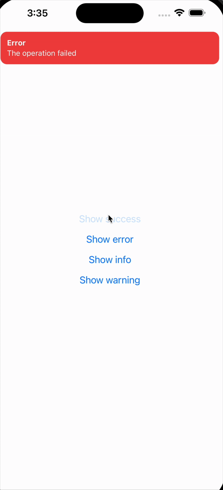

# ad-react-native-sweet-alert

A sweet and customizable alert system for React Native apps.  
Lightweight, easy-to-use, and supports animations and safe area out of the box.



---

## Installation

```sh
npm install ad-react-native-sweet-alert
# or
yarn add ad-react-native-sweet-alert
```

## Usage

Wrap your app with the provider, then call showAlert anywhere inside your code:

```tsx
import React from 'react';
import { View, Button } from 'react-native';
import { AlertProvider, showAlert } from 'ad-react-native-sweet-alert';

export default function App() {
  return (
    <AlertProvider>
      <View style={{ flex: 1, justifyContent: 'center', alignItems: 'center' }}>
        <Button
          title="Show Alert"
          onPress={() =>
            showAlert({
              title: 'Success',
              message: 'Your action was successful!',
              type: 'success', // success | error | warning | info
              animation: 'slide', // fade | slide | scale
              duration: 3000,
            })
          }
        />
      </View>
    </AlertProvider>
  );
}
```

## Configuration

You can configure global defaults in the provider:

```tsx
<AlertProvider
  config={{
    position: 'top',
    animation: 'fade',
    duration: 4000,
  }}
>
  <App />
</AlertProvider>
```

| Prop | Type | Default | Description |
|---|---|---|---|
| **position** | `"top"` \| `"bottom"` | `"top"` | Sets the vertical position of the alert. |
| **animation** | `"fade"` \| `"slide"` \| `"scale"` | `"fade"` | Specifies the animation effect for the alert. |
| **duration** | `number` | `3000` | Sets the time (in milliseconds) the alert remains visible before automatically dismissing. |
| **offset** | `number` | `0` | Adjusts the distance of the alert from the screen edge. |
| **maxVisible** | `number` | `1` | maximum number of alerts visible at once |
| **respectSafeArea** | `boolean` | `true` | Ensures the alert does not overlap with device safe areas, such as notches or status bars. |
| **extraTopInset** | `number` | `0` | Adds an extra padding to the top of the alert. |
| **extraBottomInset** | `number` | `0` | Adds an extra padding to the bottom of the alert. |


## Contributing

- [Development workflow](CONTRIBUTING.md#development-workflow)
- [Sending a pull request](CONTRIBUTING.md#sending-a-pull-request)
- [Code of conduct](CODE_OF_CONDUCT.md)


[stay in touch with me](https://gravatar.com/devamrdar)

If you like my work, you can [buy me a coffee ☕️](https://buymeacoffee.com/devamrdar) to support me.

## License

MIT © [Amr Dar](https://github.com/amrjmd1)
